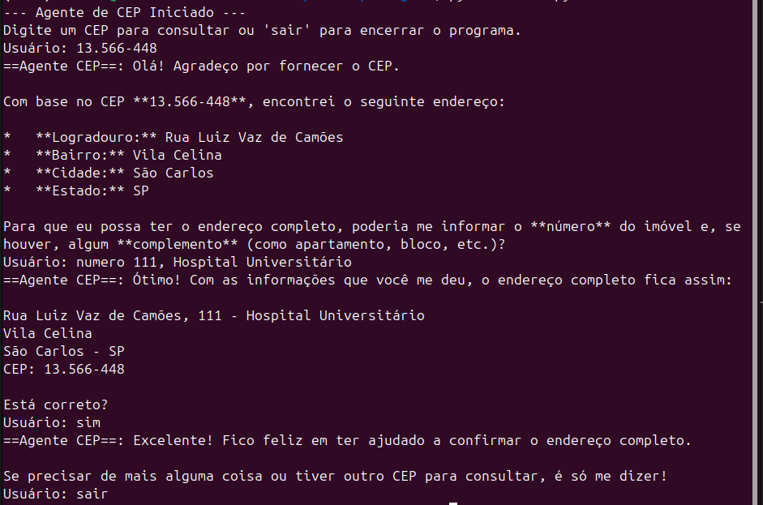
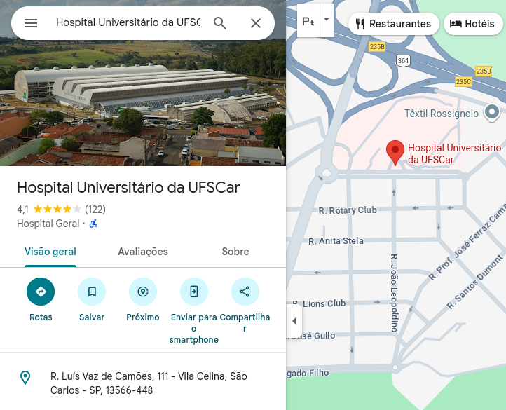

# Agente de CEP Inteligente com LangChain e LangGraph

Este projeto implementa um Agente de IA baseado no padrão ReAct (Reasoning + Acting), capaz de consultar endereços brasileiros com 100% de precisão. Ele resolve um problema comum em Grandes Modelos de Linguagem (LLMs): a tendência a "alucinar" ou inventar informações factuais específicas, como endereços residenciais baseados em CEP.

O agente foi construído utilizando **Python**, **LangChain** e **LangGraph**, usando o modelo **Google Gemini** como "cérebro" e a API pública **ViaCEP** como ferramenta externa.

## 🎯 Objetivo e Contexto

Este projeto foi desenvolvido como um estudo prático sobre:

* **Orquestração de Agentes:** Uso do LangChain e LangGraph para criar fluxos de trabalho cíclicos onde o modelo pode decidir usar ferramentas.
* **Uso de Ferramentas (Tool Calling):** Implementação do padrão onde o LLM reconhece a necessidade de dados externos e invoca funções Python específicas, um conceito central no moderno **Protocolo de Contexto de Modelo (MCP)**.
* **Integração de APIs Reais:** Conectar a capacidade de raciocínio da IA com dados determinísticos do mundo real (ViaCEP).

## 💡 O Problema vs. A Solução

LLMs são modelos probabilísticos, não bancos de dados. Quando perguntados sobre um CEP específico (especialmente os menos conhecidos), eles tendem a gerar um endereço plausível, mas incorreto.

### O Problema: Alucinação do Modelo Puro
Na imagem abaixo, vemos o modelo Gemini tentando adivinhar um endereço para o CEP `13.566-448`. Ele retorna um endereço com cidade e estado corretos porém erra quando tenta determinar o bairro e lougadouro.


*Exemplo: Modelo tentando "lembrar" um endereço e errando.*

---

### A Solução: O Agente com Ferramentas (Este Projeto)
Ao utilizar LangGraph, damos ao modelo a capacidade de "parar e consultar" uma ferramenta quando detecta um CEP. O agente consulta a API ViaCEP e retorna o dado exato.

Na imagem abaixo, o nosso agente recebe o mesmo CEP. Ele reconhece a necessidade de usar a ferramenta externa, busca o endereço correto em São Carlos (SP) e o apresenta ao usuário.


*Exemplo: Agente usando a ferramenta ViaCEP e acertando o endereço.*

Para confirmação, abaixo está a localização real no Google Maps:


## 🛠️ Tecnologias Utilizadas

* [Python 3.10+](https://www.python.org/)
* [LangChain](https://www.langchain.com/) - Framework para desenvolvimento de aplicações com LLMs.
* [LangGraph](https://langchain-ai.github.io/langgraph/) - Biblioteca para construir agentes cíclicos e com estado.
* [Google AI (Gemini)](https://ai.google.dev/) - Modelo de linguagem (LLM) utilizado.
* [ViaCEP API](https://viacep.com.br/) - Webservice gratuito para consulta de CEPs.
* `requests` & `python-dotenv` - Bibliotecas auxiliares.

## 📂 Estrutura do Projeto

O projeto está organizado de forma modular para facilitar a manutenção e o entendimento do fluxo do agente.

```text
CEPagent/
│
├── main.py          # Ponto de entrada. Inicia o loop de chat e roda o grafo.
├── graph.py         # Define a estrutura do grafo (Nós, Arestas, LLM).
├── tools.py         # Contém a definição da ferramenta de consulta à API ViaCEP.
├── state.py         # Define o esquema de estado (AgentState) do grafo.
├── prompts.py       # Contém os prompts do sistema e instruções.
├── utils.py         # Funções auxiliares (ex: limpeza de CEP).
├── __init__.py      # Marcador de pacote Python.
├── .env             # Arquivo de configuração (chaves de API).
├── requirements.txt # Lista de dependências do projeto.
└── README.md        # Documentação do projeto.
```
## 🚀 Como Rodar o Projeto

### Pré-requisitos

1.  Ter o Python instalado.
2.  Obter uma chave de API gratuita do [Google AI Studio](https://aistudio.google.com/).

### Passo a Passo

1.  **Clone o repositório:**
    ```bash
    git clone [URL_DO_SEU_REPOSITORIO_AQUI]
    cd CEPagent
    ```

2.  **Crie e ative um ambiente virtual (recomendado):**
    ```bash
    # Linux/macOS
    python -m venv venv
    source venv/bin/activate

    # Windows
    python -m venv venv
    .\venv\Scripts\activate
    ```

3.  **Instale as dependências:**
    ```bash
    pip install -r requirements.txt
    ```

4.  **Configure as Variáveis de Ambiente:**
    Crie um arquivo chamado `.env` na raiz do projeto e adicione sua chave do Google:
    ```env
    GOOGLE_API_KEY=sua_chave_aqui_xyz123...
    ```

5.  **Execute o Agente:**
    ```bash
    python main.py
    ```


